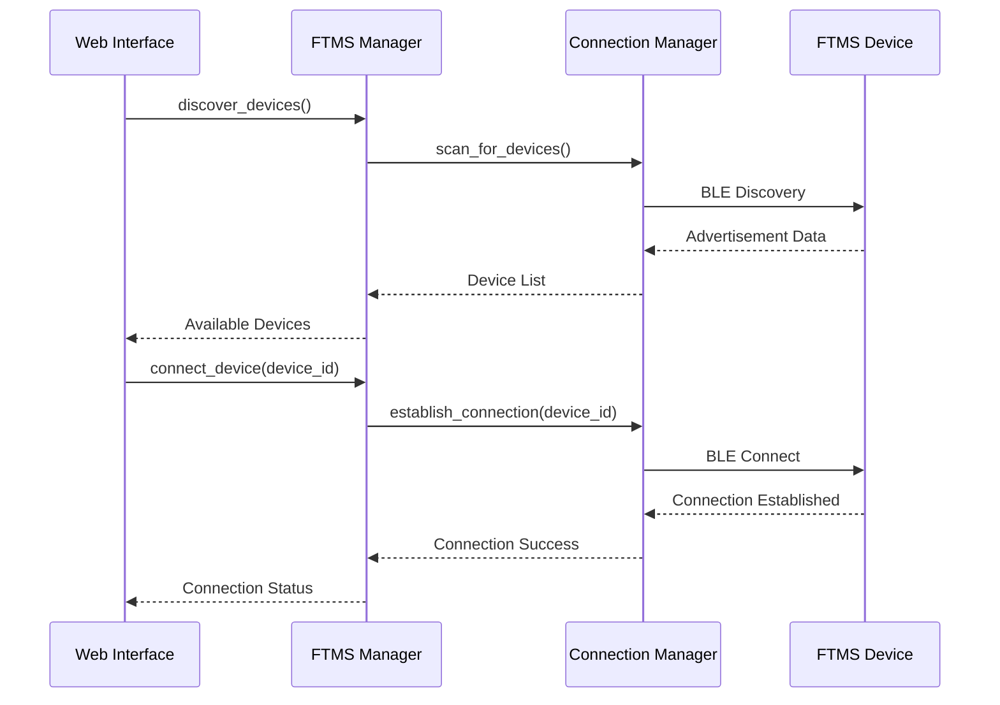
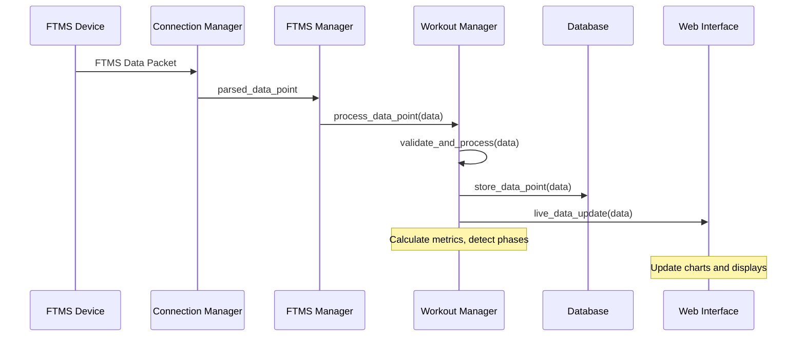
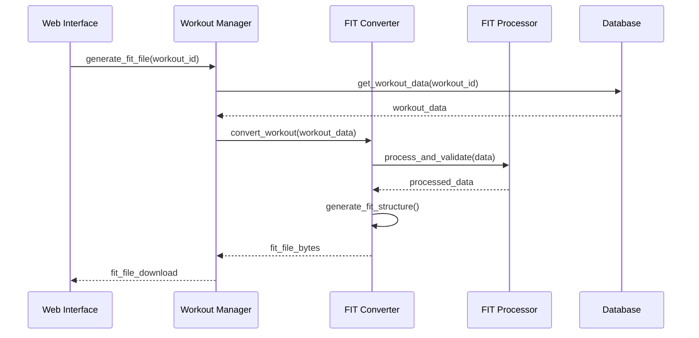

# Architecture Documentation

This document provides a comprehensive overview of the Rogue Garmin Bridge application architecture, including system design, component interactions, and technical implementation details.

## System Overview

The Rogue Garmin Bridge is a modular Python application that bridges Rogue fitness equipment to Garmin Connect through a web-based interface. The system follows a layered architecture pattern with clear separation of concerns.

```
┌─────────────────────────────────────────────────────────────────┐
│                        Presentation Layer                       │
├─────────────────┬─────────────────┬─────────────────────────────┤
│   Web Interface │   REST API      │      WebSocket API          │
│   (Flask/HTML)  │   (JSON)        │    (Real-time data)         │
└─────────────────┴─────────────────┴─────────────────────────────┘
         │                       │                       │
         ▼                       ▼                       ▼
┌─────────────────────────────────────────────────────────────────┐
│                      Application Layer                          │
├─────────────────┬─────────────────┬─────────────────────────────┤
│ Workout Manager │   FTMS Manager  │      FIT Converter          │
│                 │                 │                             │
└─────────────────┴─────────────────┴─────────────────────────────┘
         │                       │                       │
         ▼                       ▼                       ▼
┌─────────────────────────────────────────────────────────────────┐
│                       Service Layer                             │
├─────────────────┬─────────────────┬─────────────────────────────┤
│ Data Processor  │ Connection Mgr  │    File Processor           │
│                 │                 │                             │
└─────────────────┴─────────────────┴─────────────────────────────┘
         │                       │                       │
         ▼                       ▼                       ▼
┌─────────────────────────────────────────────────────────────────┐
│                        Data Layer                               │
├─────────────────┬─────────────────┬─────────────────────────────┤
│    Database     │ FTMS Connector/ │      File System            │
│   (SQLite)      │   Simulator     │                             │
└─────────────────┴─────────────────┴─────────────────────────────┘
```

## Core Components

### 1. Web Interface Layer

**Technology Stack**:
- **Backend**: Flask 2.3+ (Python web framework)
- **Frontend**: HTML5, CSS3, JavaScript (ES6+)
- **Real-time Communication**: Server-Sent Events (SSE) / WebSocket
- **Styling**: Custom CSS with responsive design
- **Charts**: Chart.js for data visualization

**Key Files**:
- `src/web/app.py`: Main Flask application
- `src/web/templates/`: HTML templates (Jinja2)
- `src/web/static/`: Static assets (CSS, JS, images)

**Responsibilities**:
- User interface rendering and interaction
- Real-time data display and updates
- API endpoint handling
- Session management and security

### 2. Application Layer

#### FTMS Manager (`src/ftms/ftms_manager.py`)

**Purpose**: Unified interface for FTMS device management

**Key Features**:
- Device discovery and connection management
- Data callback registration and notification
- Connection quality monitoring
- Error handling and recovery

**Interface**:
```python
class FTMSManager:
    def discover_devices(self) -> List[Device]
    def connect_device(self, device_id: str) -> bool
    def disconnect_device(self, device_id: str) -> bool
    def register_data_callback(self, callback: Callable)
    def get_connection_status(self, device_id: str) -> ConnectionStatus
```

#### Workout Manager (`src/data/workout_manager.py`)

**Purpose**: Workout session lifecycle management

**Key Features**:
- Workout session creation and management
- Real-time data processing and validation
- Metric calculation and aggregation
- Database integration for persistence

**Interface**:
```python
class WorkoutManager:
    def start_workout(self, device_type: str) -> str
    def process_data_point(self, workout_id: str, data: DataPoint)
    def end_workout(self, workout_id: str) -> WorkoutSummary
    def get_live_data(self, workout_id: str) -> LiveData
```

#### FIT Converter (`src/fit/fit_converter.py`)

**Purpose**: Garmin FIT file generation and validation

**Key Features**:
- FIT file structure creation
- Data mapping and validation
- Device identification for training load
- Garmin Connect compatibility

**Interface**:
```python
class FITConverter:
    def convert_workout(self, workout_data: WorkoutData) -> bytes
    def validate_fit_file(self, fit_data: bytes) -> ValidationResult
    def analyze_fit_file(self, fit_path: str) -> AnalysisResult
```

### 3. Service Layer

#### Data Processor (`src/data/data_processor.py`)

**Purpose**: Data validation, processing, and analysis

**Key Features**:
- Real-time data validation
- Outlier detection and filtering
- Missing data interpolation
- Statistical analysis and metrics

#### Connection Manager (`src/ftms/connection_manager.py`)

**Purpose**: Low-level Bluetooth connection management

**Key Features**:
- BLE connection establishment and maintenance
- Signal quality monitoring
- Automatic reconnection with backoff
- Error handling and diagnostics

#### File Processor (`src/fit/fit_processor.py`)

**Purpose**: Advanced FIT file processing and analysis

**Key Features**:
- FIT file parsing and validation
- Training load calculation
- Speed calculation optimization
- Compatibility verification

### 4. Data Layer

#### Database (`src/data/database_manager.py`)

**Technology**: SQLite with SQLAlchemy ORM

**Schema Design**:
```sql
-- Workouts table
CREATE TABLE workouts (
    id INTEGER PRIMARY KEY,
    device_type TEXT NOT NULL,
    start_time TIMESTAMP NOT NULL,
    end_time TIMESTAMP,
    duration INTEGER,
    total_distance REAL,
    total_calories INTEGER,
    avg_power INTEGER,
    max_power INTEGER,
    avg_heart_rate INTEGER,
    max_heart_rate INTEGER,
    created_at TIMESTAMP DEFAULT CURRENT_TIMESTAMP
);

-- Data points table
CREATE TABLE data_points (
    id INTEGER PRIMARY KEY,
    workout_id INTEGER REFERENCES workouts(id),
    timestamp TIMESTAMP NOT NULL,
    power INTEGER,
    heart_rate INTEGER,
    cadence INTEGER,
    speed REAL,
    distance REAL,
    calories INTEGER,
    stroke_rate INTEGER,
    data_quality TEXT DEFAULT 'good'
);
```

#### FTMS Connector/Simulator

**Real Device Connection** (`src/ftms/ftms_connector.py`):
- Uses `pyftms` library for BLE communication
- Implements FTMS protocol for bike and rower
- Handles device-specific data parsing

**Simulator** (`src/ftms/ftms_simulator.py`):
- Provides realistic workout data for testing
- Based on analysis of real workout patterns
- Configurable scenarios and error injection

## Data Flow Architecture

### 1. Device Connection Flow



### 2. Workout Data Flow



### 3. FIT File Generation Flow



## Design Patterns and Principles

### 1. Observer Pattern

**Implementation**: Data callback system for real-time updates

```python
class DataObserver:
    def __init__(self):
        self._observers = []
    
    def register_observer(self, callback: Callable):
        self._observers.append(callback)
    
    def notify_observers(self, data):
        for callback in self._observers:
            callback(data)
```

**Usage**:
- FTMS Manager notifies Workout Manager of new data
- Workout Manager notifies Web Interface of processed data
- Connection Manager notifies of status changes

### 2. Strategy Pattern

**Implementation**: Different processing strategies for device types

```python
class DataProcessingStrategy:
    def process_data(self, raw_data: dict) -> ProcessedData:
        raise NotImplementedError

class BikeDataProcessor(DataProcessingStrategy):
    def process_data(self, raw_data: dict) -> ProcessedData:
        # Bike-specific processing logic
        pass

class RowerDataProcessor(DataProcessingStrategy):
    def process_data(self, raw_data: dict) -> ProcessedData:
        # Rower-specific processing logic
        pass
```

### 3. Factory Pattern

**Implementation**: Device-specific component creation

```python
class DeviceFactory:
    @staticmethod
    def create_processor(device_type: str) -> DataProcessingStrategy:
        if device_type == "bike":
            return BikeDataProcessor()
        elif device_type == "rower":
            return RowerDataProcessor()
        else:
            raise ValueError(f"Unknown device type: {device_type}")
```

### 4. Repository Pattern

**Implementation**: Data access abstraction

```python
class WorkoutRepository:
    def __init__(self, db_session):
        self.db = db_session
    
    def save_workout(self, workout: Workout) -> str:
        # Database-specific save logic
        pass
    
    def get_workout(self, workout_id: str) -> Workout:
        # Database-specific retrieval logic
        pass
```

## Configuration Management

### 1. Environment-based Configuration

**Configuration Files**:
- `config/development.py`: Development settings
- `config/production.py`: Production settings
- `config/testing.py`: Test environment settings

**Configuration Structure**:
```python
class Config:
    # Database configuration
    DATABASE_URL = os.environ.get('DATABASE_URL', 'sqlite:///data/workouts.db')
    
    # Flask configuration
    SECRET_KEY = os.environ.get('SECRET_KEY', 'dev-key')
    DEBUG = False
    
    # FTMS configuration
    CONNECTION_TIMEOUT = 30
    RECONNECTION_ATTEMPTS = 3
    DATA_QUALITY_THRESHOLD = 0.8
    
    # Performance settings
    CHART_UPDATE_INTERVAL = 1000  # milliseconds
    DATA_RETENTION_DAYS = 365
    MAX_CONCURRENT_WORKOUTS = 1
```

### 2. Runtime Configuration

**Settings Management**:
- User preferences stored in database
- System settings configurable via web interface
- Runtime configuration updates without restart

**Configuration Categories**:
- User Profile: Personal information and preferences
- Workout Settings: Default workout parameters
- System Settings: Performance and connection parameters
- Data Management: Retention and backup settings

## Security Considerations

### 1. Data Protection

**Local Data Security**:
- Database encryption at rest (optional)
- Secure file permissions for sensitive data
- User data anonymization options
- GDPR compliance considerations

**Network Security**:
- HTTPS enforcement in production
- Session management with secure cookies
- CSRF protection for form submissions
- Input validation and sanitization

### 2. Bluetooth Security

**Device Communication**:
- Secure BLE pairing procedures
- Connection authentication where supported
- Data transmission validation
- Device identity verification

### 3. Web Interface Security

**Authentication and Authorization**:
- Session-based authentication
- Role-based access control (future enhancement)
- Secure password handling
- Session timeout management

## Performance Optimization

### 1. Database Optimization

**Query Optimization**:
- Proper indexing for common queries
- Query result caching
- Connection pooling
- Batch operations for bulk data

**Schema Design**:
- Normalized schema for data integrity
- Denormalized views for performance
- Partitioning for large datasets
- Archive strategy for old data

### 2. Real-time Data Processing

**Data Pipeline Optimization**:
- Asynchronous data processing
- Buffering for high-frequency data
- Efficient data structures
- Memory management for long sessions

**Chart Rendering Optimization**:
- Data decimation for large datasets
- Client-side caching
- Progressive loading
- Responsive design optimization

### 3. Memory Management

**Memory Optimization Strategies**:
- Object pooling for frequently created objects
- Garbage collection optimization
- Memory leak detection and prevention
- Resource cleanup on session end

## Error Handling and Logging

### 1. Error Handling Strategy

**Error Categories**:
- **Connection Errors**: Bluetooth and network issues
- **Data Errors**: Invalid or corrupted data
- **System Errors**: Resource and configuration issues
- **User Errors**: Invalid input and usage errors

**Error Handling Patterns**:
```python
class ErrorHandler:
    def handle_connection_error(self, error: ConnectionError):
        # Log error, attempt recovery, notify user
        pass
    
    def handle_data_error(self, error: DataError):
        # Log error, apply data correction, continue processing
        pass
    
    def handle_system_error(self, error: SystemError):
        # Log error, perform cleanup, graceful shutdown if needed
        pass
```

### 2. Logging Architecture

**Logging Configuration**:
- Structured logging with JSON format
- Component-specific loggers
- Configurable log levels
- Log rotation and retention

**Log Categories**:
- `application.log`: General application events
- `bluetooth.log`: Bluetooth connection details
- `data_flow.log`: Data processing information
- `performance.log`: Performance metrics
- `error.log`: Error messages and stack traces

## Testing Architecture

### 1. Test Structure

**Test Categories**:
- **Unit Tests**: Individual component testing
- **Integration Tests**: Component interaction testing
- **End-to-End Tests**: Complete workflow testing
- **Performance Tests**: Load and stress testing

**Test Organization**:
```
tests/
├── unit/
│   ├── test_ftms_manager.py
│   ├── test_workout_manager.py
│   ├── test_fit_converter.py
│   └── test_database.py
├── integration/
│   ├── test_data_flow.py
│   ├── test_web_api.py
│   └── test_cross_component.py
├── performance/
│   ├── test_load_testing.py
│   └── test_stress_testing.py
└── fixtures/
    ├── sample_data.json
    └── mock_devices.py
```

### 2. Test Infrastructure

**Mock and Simulation**:
- FTMS device simulator for testing
- Database mocking for unit tests
- Network simulation for integration tests
- Performance monitoring during tests

**Continuous Integration**:
- Automated test execution
- Code coverage reporting
- Performance regression detection
- Integration with version control

## Deployment Architecture

### 1. Development Environment

**Local Development Setup**:
- Virtual environment isolation
- Development database
- Hot reloading for rapid development
- Debug mode with detailed error reporting

### 2. Production Environment

**Production Deployment Options**:
- **Standalone**: Direct Python execution
- **Docker**: Containerized deployment
- **WSGI**: Production web server (Gunicorn, uWSGI)
- **Reverse Proxy**: Nginx for static files and SSL

**Production Configuration**:
- Environment variable configuration
- Production database setup
- SSL/TLS certificate management
- Monitoring and alerting setup

### 3. Scalability Considerations

**Horizontal Scaling**:
- Stateless application design
- Database connection pooling
- Load balancing for multiple instances
- Session storage externalization

**Vertical Scaling**:
- Memory optimization
- CPU utilization optimization
- I/O performance tuning
- Resource monitoring and alerting

## Future Architecture Enhancements

### 1. Microservices Migration

**Service Decomposition**:
- Device Management Service
- Workout Processing Service
- FIT File Generation Service
- User Management Service

**Benefits**:
- Independent scaling
- Technology diversity
- Fault isolation
- Team autonomy

### 2. Cloud Integration

**Cloud Services Integration**:
- Cloud storage for workout data
- Cloud-based FIT file processing
- Real-time data streaming
- Serverless function integration

### 3. Mobile Application

**Mobile Architecture**:
- Native mobile applications
- Shared API backend
- Offline capability
- Push notifications

**Integration Points**:
- Shared data models
- Common authentication
- Synchronized user preferences
- Cross-platform data sharing

This architecture documentation provides a comprehensive foundation for understanding, maintaining, and extending the Rogue Garmin Bridge application.